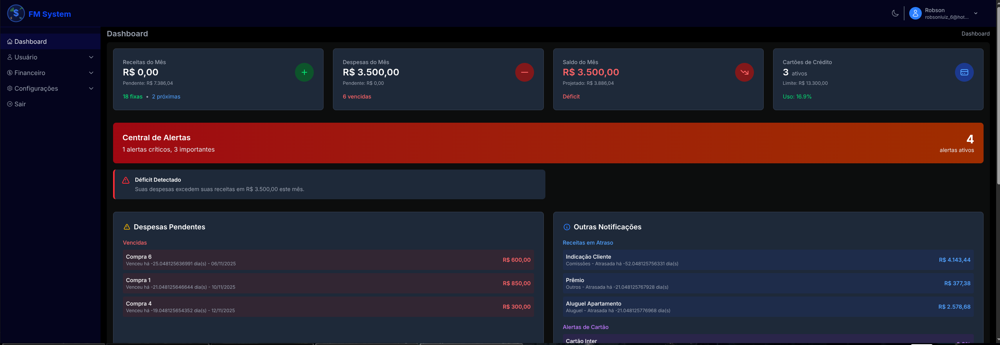
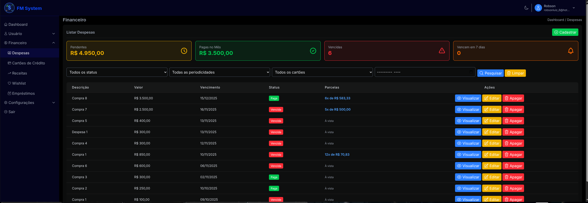
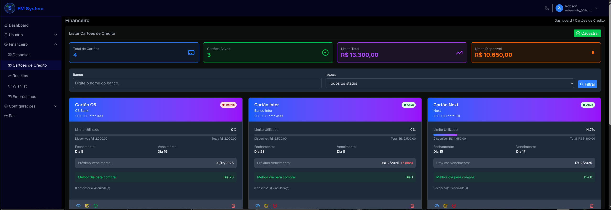
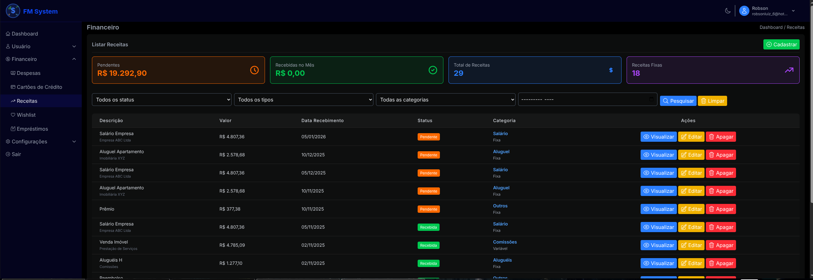

# **FM System v2** - Personal Financial Management System with Laravel 12

> 💡 **About Versions**: This is version 2 of FM System, completely rewritten with Laravel 12. Version 1 was developed in pure PHP and is not publicly available.

---

## 🌐 **Languages / Idiomas**

- 🇺🇸 **English**: [README.en.md](./README.en.md)
- 🇧🇷 **Português**: [README.md](./README.md)

---

## Screenshots

### Dashboard


_Complete financial dashboard with statistics, charts, and intelligent alerts_

### Expense Management


_Advanced expense management with flexible installments system_

### Credit Card Control


_Intelligent credit card management with real-time limit control_

### Income System


_Complete income management with categorization and smart filters_

## Requirements

- PHP 8.2 or higher - Check version: php -v
- MySQL 8.0 or higher - Check version: mysql --version
- Composer - Check installation: composer --version
- Node.js 22 or higher - Check version: node -v
- NPM or Yarn - To manage Node.js dependencies and compile assets
- GIT - Check if GIT is installed: git -v

**Frontend:**

- Tailwind CSS v4 - Included as project dependency (installed via npm)

## How to Run the Downloaded Project

First, download the project from GitHub repository:

```
git clone https://github.com/robson-luiz/fm-system-v2-laravel.git
cd fm-system-v2-laravel
```

- Duplicate the ".env.example" file and rename to ".env".
- Change the database credentials.

```
DB_CONNECTION=mysql
DB_HOST=127.0.0.1
DB_PORT=3306
DB_DATABASE=fm_system_v2
DB_USERNAME=root
DB_PASSWORD=
```

- For email functionality to work, you need to change the email server credentials in the .env file.
- Use fake server during development: [Access free email sending](https://mailtrap.io)

```
MAIL_MAILER=smtp
MAIL_SCHEME=null
MAIL_HOST=sandbox.smtp.mailtrap.io
MAIL_PORT=2525
MAIL_USERNAME=mailtrap-username
MAIL_PASSWORD=mailtrap-password
MAIL_FROM_ADDRESS="sender-email@my-domain.com"
MAIL_FROM_NAME="${APP_NAME}"
```

Install PHP dependencies.

```
composer install
```

Install Node.js dependencies.

```
npm install
```

Generate key in .env file.

```
php artisan key:generate
```

Run migrations to create tables and columns.

```
php artisan migrate
```

Run seeder with php artisan to register test records.

```
php artisan db:seed
```

Start the Laravel project.

```
php artisan serve
```

Run Node.js libraries.

```
npm run dev
```

Run Jobs on local PC.

```
php artisan queue:work
```

Access the page created with Laravel.

```
http://127.0.0.1:8000
```

## Included Libraries and Dependencies

The project comes with the following pre-installed libraries:

**Frontend:**

- **Tailwind CSS v4** - Utility-first CSS framework
- **Alpine.js v3** - Reactive JavaScript framework
- **Chart.js v4** - Chart library
- **SweetAlert2** - Elegant custom alerts

**Backend:**

- **Spatie Laravel Permission** - Permissions and roles system
- **OwenIt Laravel Auditing** - System action auditing
- **Intervention Image** - Image manipulation
- **Laravel Tinker** - Laravel interactive REPL

**Development:**

- **Laravel Pint** - PHP code formatter
- **Laravel Sail** - Docker environment (optional)
- **Faker** - Fake data generation for testing

## About the Project

### FM System v2

**FM System v2** is a personal financial management system developed with Laravel 12, focused on helping users control their finances intelligently and proactively.

**Why version 2?**

This project is the **second version** of FM System. Version 1 was developed entirely in pure PHP as part of initial web development learning. With the advancement of studies and adoption of modern frameworks, the system was completely rewritten using Laravel 12, bringing:

- 🏗️ Robust MVC architecture
- 🔒 Integrated authentication and permissions system
- 🎨 Modern interface with Tailwind CSS v4
- ⚡ Optimized performance
- 📝 Organized and scalable code
- 🧪 Easy testing

Version 1 (pure PHP) remains as a personal learning project and is not publicly available.

### Main Features

- 🔐 **Robust authentication system** with two-factor login (2FA)
- 💰 **Intelligent expense management** with flexible installments system
- 💳 **Credit card control** with best purchase date analysis
- 📊 **Financial dashboard** with detailed charts and reports
- 📈 **Cash flow analysis** with AI-based future projections
- 🎯 **Intelligent wishlist** with financial viability analysis
- 🔔 **Proactive alerts** for payments and due dates
- 👥 **Complete permissions system** and action auditing
- 🎨 **Modern interface** with light/dark theme and responsive design

### Roadmap

**Initial System Base** ✅ Completed

- [x] Authentication and permissions system (Spatie)
- [x] User management with roles
- [x] Auditing system (OwenIt/laravel-auditing)
- [x] Responsive interface with Tailwind CSS v4
- [x] Light/dark theme support

**Phase 1 - Expense Management** ✅ Completed (10/07/2025)

- [x] Complete expense CRUD
- [x] Installments system with separate table
- [x] Fixed installments (equal values)
- [x] Flexible installments (custom values)
- [x] Real-time value validation
- [x] Individual installment payment marking
- [x] Payment history

**Phase 2 - Two-Factor Login** ✅ Completed (10/25/2025)

- [x] Two-factor authentication (2FA) implementation
- [x] Administrative configuration for sending method choice
- [x] Code sending via email
- [x] Code sending via SMS
- [x] Configuration interface in administrative panel
- [x] Validation and verification of temporary codes
- [x] Backup codes for access recovery
- [x] Security logs for login attempts
- [x] **Custom SMS Providers**: Configure any SMS provider (Iagente, ZenviaNow, TotalVoice, etc)
- [x] **Complete 2FA system verification** - (11/09/2025)

**Phase 3 - Credit Cards** ✅ Completed (11/09/2025)

- [x] Credit card CRUD
- [x] Expense linking with cards
- [x] Limit and invoice control
- [x] Best purchase day alert
- [x] Automatic available limit calculation
- [x] Observer for real-time updates
- [x] UI/UX adjustments and mobile responsiveness

**Phase 4 - Income System** ✅ Completed (11/16/2025)

- [x] Complete income CRUD
- [x] Categorization system (Salary, Freelance, Sales, Investments, Rent, Commissions, Others)
- [x] Income types (Fixed and Variable)
- [x] Receipt status (Pending and Received)
- [x] Standardized tabular interface following expense pattern
- [x] Real-time statistics (pending, received in month, total, fixed incomes)
- [x] Advanced filters by status, type, category and monthly period
- [x] Income source/origin system
- [x] Custom observations
- [x] Seeder with realistic data for testing
- [x] Complete validations (frontend and backend)
- [x] **Refinements (11/16/2025)**: Edit form corrections, centralized masks, SweetAlert2 and theme adjustments

**Phase 5 - Dashboard and Reports** ✅ Completed (11/30/2025)

- [x] Main financial dashboard with general statistics
- [x] Interactive charts (Chart.js) of income vs expenses
- [x] Automatic pending payment verification
- [x] Intelligent alerts system
- [x] Alert center with priorities (high, medium, low)
- [x] Financial health analysis (deficit/surplus)
- [x] Credit card usage charts
- [x] Responsive interface with light/dark theme

**Phase 5.1 - Advanced Analytics** ✅ Completed (12/14/2025)

- [x] **Intelligent Verification Modal**: System that checks pending accounts on login and asks "Have these accounts been paid?" with automatic status update - ✅ (12/08/2025)
- [x] **Dynamic Dashboard Update**: Automatic statistics recalculation after account status changes - ✅ (12/08/2025)
- [x] **Monthly/annual cash flow analysis with projections** - ✅ (12/14/2025)
- [x] **Intelligent wishlist with financial viability analysis** - ✅ (12/14/2025)
- [x] **Category system for expenses (Food, Transportation, Leisure, etc.)** - ✅ (12/22/2025)
- [x] **Trend and projection reports based on history** - ✅ (01/03/2026)

**Phase 5.2 - Loan Management** 📋 Planned

- [ ] **Complete loan CRUD** (loans granted and received)
- [ ] **Type system**: lent to others, borrowed from third parties
- [ ] **Installment control with configurable interest** (simple and compound)
- [ ] **Integration with cash flow** and financial projections
- [ ] **Due date alerts** for installments and critical delays
- [ ] **Payment history** and renegotiation system
- [ ] **Loan reports** active/settled with default analysis
- [ ] **Automatic calculation** of simple and compound interest
- [ ] **Complete amortization table** per loan
- [ ] **Loan simulator** with different scenarios

**Phase 6 - Advanced Features** 📋 Future

> 💡 **Note**: This phase was reorganized to include originally planned features and new suggestions incorporated into the project.

- [ ] **Category spending comparison** with financial goals
- [ ] **Alerts for significant changes** in consumption patterns
- [ ] **Financial goals system** by category
- [ ] **Report export** in PDF/Excel (using Laravel DomPDF)
- [ ] **Refined Multi-User System**: Complete data isolation per user (security review)
- [ ] **Automated Daily Email**: Automatic notifications for due bills (Laravel Scheduler + CRON)
- [ ] **Customizable Settings**: `user_settings` table to enable/disable notifications and modals per user
- [ ] **Enhanced Role System**: FM System specific roles (Admin, Premium User, Basic User) via Spatie
- [ ] **User Profile Improvements**: Profile photo upload (Intervention Image) and activity history
- [ ] **Development Environment Security**: Display test credentials only when `APP_ENV=local`

---

## 🐛 Known Bugs

### Reported Bugs Pending Fix

- 🔴 **Registration Form**: Error accepting terms of use - "You must accept the Terms of Use" appears even when checkbox is marked
  - **URL**: `/register`
  - **Status**: 🚧 Pending fix
  - **Priority**: High (prevents new registrations)

---

## Implemented Features

### 📊 Expense System (Phase 1 - Completed on 10/07/2025)

#### **Complete CRUD**

- ✅ Listing with filters (status, periodicity, card, month, **category**)
- ✅ Registration with validations
- ✅ Detailed viewing
- ✅ Expense editing
- ✅ Deletion with confirmation (SweetAlert2)

#### **Category System** (Implemented on 12/22/2025)

**Expense Categorization**

- 8 default categories with emoji icons and custom colors:
  - 🍽️ Food (#F59E0B - Amber)
  - 🚗 Transportation (#3B82F6 - Blue)
  - 🎮 Leisure (#8B5CF6 - Purple)
  - 💊 Health (#10B981 - Green)
  - 📚 Education (#06B6D4 - Cyan)
  - 🏠 Housing (#14B8A6 - Teal)
  - 🔧 Services (#EF4444 - Red)
  - 📌 Others (#6B7280 - Gray)

**Features**

- ✅ Category Model with auditing
- ✅ Relationship between Expense and Category
- ✅ Selection dropdown in forms
- ✅ Category filter in listing
- ✅ Colored badges with icon and name
- ✅ Optional system (expenses can have no category)
- ✅ Scopes: `active()` and `orderedByName()`

#### **Intelligent Installments System**

**1. Refactored Architecture**

- Separate `installments` table to manage installments
- Each expense can have multiple independent installments
- `hasMany` relationship between Expense and Installment

**2. Installment Types**

**Fixed Installments (Automatic)**

```
Amount: R$ 3,000.00 | Installments: 3
Result: 3x of R$ 1,000.00
```

- System divides automatically
- Last installment adjusts rounding
- Monthly calculated dates

**Flexible Installments (Custom)**

```
Example: Down payment + Different installments
- Down payment: R$ 500.00 (Nov/2025)
- Installment 2: R$ 300.00 (Dec/2025)
- Installment 3: R$ 400.00 (Jan/2026)
- Installment 4: R$ 300.00 (Feb/2026)
```

- Custom values for each installment
- Individual due dates
- Real-time sum validation
- Visual feedback: ✓ (correct) | ⚠ (difference)

**3. Individual Installment Management**

- Table view on details page
- Statistics: Total, Paid, Pending, Overdue
- Mark individual installment as paid (via AJAX)
- Undo installment payment
- Interactive modals with SweetAlert2

**4. Interface and UX**

- Intuitive toggle: "Equal Installments" ↔ "Custom Installments"
- Dynamic field generator
- Money mask (R$ 1,000.00)
- Automatic conversion on submit
- Light/dark theme support
- Responsive (mobile-first)

**5. Technical Features**

- **DB Transactions**: Guaranteed atomicity
- **Eager Loading**: Optimized performance
- **AJAX**: Actions without page reload
- **Validations**: Frontend (JavaScript) + Backend (Laravel)
- **Auditing**: All actions recorded
- **Permissions**: Granular control per action

#### **Alerts and Feedback**

- Overdue expenses (red badge)
- Due soon (7 days - orange badge)
- Visual status by colors
- Success/error messages with SweetAlert2

#### **Filters and Search**

- Filter by status (pending, paid)
- Filter by periodicity
- Filter by credit card
- Filter by month/year
- Statistics in cards

### 🔐 2FA Authentication System (Phase 2 - Completed on 10/25/2025)

#### **Two-Factor Authentication**

- ✅ **Email Verification**: 6-digit codes via SMTP
- ✅ **SMS Verification**: SMS provider integration
- ✅ **Backup Codes**: Emergency recovery codes
- ✅ **Flexible Configuration**: Admin chooses default method per user

#### **Complete Administrative Panel**

- ✅ **Email Settings**: Configurable SMTP via interface
- ✅ **SMS Settings**: Multiple supported providers
- ✅ **Integrated Testing**: Direct sending test in panel
- ✅ **Statistics**: Monitoring of sent/validated codes

#### **Custom SMS Providers** 🇧🇷

**Revolutionary system that allows configuring ANY SMS provider**

**Features:**

- ✅ **Total Flexibility**: Configure any REST API
- ✅ **Brazilian Providers**: Iagente, ZenviaNow, TotalVoice
- ✅ **International Providers**: Twilio, Nexmo, etc
- ✅ **User-Friendly Interface**: Configure without touching code
- ✅ **Real-Time Testing**: Validation before activation

**Simple Configuration:**

```
Name: Iagente
URL: https://api.iagente.com.br/v1/sms/send
Method: POST
Phone Field: to
Message Field: message
Headers: Authorization: Bearer TOKEN
Indicators: status: success
```

**Benefits:**

- 🚫 **No Vendor Lock-in**: Change provider whenever you want
- 🇧🇷 **National Support**: Use Brazilian companies
- 💰 **Economy**: Choose the cheapest provider
- 🔧 **Zero Maintenance**: Configure once, works always
- 📊 **Detailed Logs**: Monitor all sends

#### **2FA Technical Features**

- **Guzzle HTTP**: Robust HTTP client for SMS APIs
- **Dynamic Validation**: Customizable headers and fields
- **Rate Limiting**: Protection against code spam
- **Complete Auditing**: Log of all attempts
- **Advanced Security**: Codes with expiration time

### 💳 Credit Card System (Phase 3 - Completed on 11/02/2025)

#### **Complete Card CRUD**

- ✅ **Intelligent Listing**: Visual cards with real-time statistics
- ✅ **Advanced Registration**: Validations, money masks and automatic calculations
- ✅ **Detailed Viewing**: "Physical card" type interface with complete information
- ✅ **Flexible Editing**: Updates with automatic/manual limit control

#### **Intelligent Limit Control**

- ✅ **Automatic Calculation**: Observer updates limit in real-time based on expenses
- ✅ **Manual Mode**: Direct user control over available limit
- ✅ **Validations**: Prevents available limit greater than total limit
- ✅ **Visual Feedback**: Circular charts and usage progress bars

#### **Expense Integration**

- ✅ **Automatic Linking**: Expenses linked to specific cards
- ✅ **Real-Time Updates**: Observer monitors expense creation/editing/deletion
- ✅ **Transaction History**: View of recent expenses by card
- ✅ **Detailed Statistics**: Total expenses, pending and paid amounts

#### **Best Purchase Day Analysis**

- ✅ **Automatic Calculation**: System identifies best date based on closing
- ✅ **Manual Configuration**: User can define preferred day
- ✅ **Visual Alerts**: Highlight of next due date and remaining days
- ✅ **Financial Planning**: Information to maximize payment term

#### **Interface and UX**

- ✅ **Responsive Design**: Adapted for mobile and desktop
- ✅ **Light/Dark Theme**: Complete support for both themes
- ✅ **Money Masks**: Automatic formatting of monetary values
- ✅ **Intelligent Alerts**: SweetAlert2 for confirmations and feedback
- ✅ **Intuitive Navigation**: Breadcrumbs and contextual action buttons

#### **Technical Features**

- **Observer Pattern**: ExpenseObserver for automatic limit updates
- **Eloquent Relationships**: Optimized relationships between cards and expenses
- **Modular JavaScript**: Money masks and real-time validations
- **Versioned Migrations**: `auto_calculate_limit` field for configuration
- ✅ **Artisan Command**: `credit-cards:update-limits` for maintenance
- ✅ **Readability Adjustments (11/16/2025)**: Text color improvements for dark theme

> ⚠️ **Status**: Complete and operational functionality. Readability adjustments implemented on 11/16/2025.

### 💰 Income System (Phase 4 - Completed on 11/16/2025)

#### **Complete Income CRUD**

- ✅ **Intelligent Listing**: Standardized tabular interface following expense pattern
- ✅ **Advanced Registration**: Form with complete validations and centralized money mask
- ✅ **Detailed Viewing**: Informative cards with all income information
- ✅ **Refined Editing**: Fixed form with pre-filled data and functional categories

#### **Categorization System**

- ✅ **Default Categories**: Salary, Freelance, Sales, Investments, Rent, Commissions, Others
- ✅ **Income Types**:
  - **Fixed**: Regular and predictable income (salary, rent)
  - **Variable**: Occasional and variable income (freelance, sales)
- ✅ **Source/Origin**: Optional field to identify income source
- ✅ **Receipt Status**: Pending (orange) and Received (green)

#### **Real-Time Statistics**

- ✅ **Pending**: Total amount in pending income (R$)
- ✅ **Received in Month**: Total received in current month (R$)
- ✅ **Total Income**: Total count of registered income
- ✅ **Fixed Income**: Count of fixed type income

#### **Filter and Search System**

- ✅ **Status Filter**: All, Pending, Received
- ✅ **Type Filter**: All, Fixed Income, Variable Income
- ✅ **Category Filter**: All available categories
- ✅ **Period Filter**: Specific month/year selection
- ✅ **Action Buttons**: Search (blue) and Clear filters (yellow)

#### **Interface and User Experience**

- ✅ **Consistent Design**: Follows exactly the visual pattern of expenses
- ✅ **Responsive Table**: Hidden columns on mobile, adapted information
- ✅ **Contextual Actions**: View, Edit and Delete with intuitive icons
- ✅ **Real-Time Validations**: Centralized money masks via `money-mask.js`
- ✅ **Visual Feedback**: SweetAlert2 integrated for elegant deletion
- ✅ **Light/Dark Theme**: Text color readability adjustments

#### **Technical Features**

- **Eloquent Scopes**: `forUser()`, `byStatus()`, `byCategory()`, `byType()`, `currentMonth()`
- **Request Validation**: `IncomeRequest` with complete validations
- **Intelligent Seeder**: `IncomeSeeder` with realistic data from last 6 months
- **Automatic Formatting**: Accessors for formatted monetary values
- **Relationships**: Income linked to users with access control
- **Modular JavaScript**: Centralized scripts for money masks

#### **Technical Refinements (11/16/2025)**

- ✅ **Edit Form**: Fixed problem with `getDefaultCategories()` replaced by `$categories`
- ✅ **Money Masks**: Centralized in `money-mask.js`, removed duplicate scripts
- ✅ **SweetAlert2**: Implemented for income deletion with elegant modals
- ✅ **Readability**: Adjusted text colors for dark theme in cards
- ✅ **Tests**: Fixed 2 failing tests, all 9 tests now pass

#### **Realistic Test Data**

- ✅ **Comprehensive Period**: Income from last 6 months + next 3 months
- ✅ **Value Variety**: Based on category (salary: R$ 2,800-12,000)
- ✅ **Recurring Income**: Fixed monthly salary and rent
- ✅ **Contextual Observations**: Category-specific notes
- ✅ **Intelligent Status**: 85% of past income marked as received

### 📊 Dashboard and Reports (Phase 5 - Completed on 11/30/2025)

#### **Complete Financial Dashboard**

- ✅ **Statistical Cards**: Monthly income, expenses, credit cards and general balance
- ✅ **DashboardController**: Optimized system with aggregated queries for performance
- ✅ **AlertService**: Dedicated service for analysis and intelligent alert generation
- ✅ **Real-Time Statistics**: All data updated dynamically

#### **Intelligent Alert System**

- ✅ **Alert Center**: Dedicated interface with theme-aware colors (soft red)
- ✅ **Priorities**: High, medium and low priority system with counters
- ✅ **Financial Alerts**: Automatic detection of deficit, investment opportunities
- ✅ **Due Alerts**: Overdue expenses, due soon, overdue income
- ✅ **Card Alerts**: Limit close to maximum, best purchase dates
- ✅ **Intelligent Suggestions**: Recommended actions for each alert type

#### **Interactive Charts with Chart.js v4**

- ✅ **Income vs Expenses**: Comparative line chart of last 6 months
- ✅ **Card Usage**: Donut chart showing usage percentage per card
- ✅ **Theme Compatible**: Colors that automatically adapt to light/dark theme
- ✅ **Responsiveness**: Charts optimized for mobile and desktop

#### **Interface and User Experience**

- ✅ **Responsive Design**: Mobile-first with perfect adaptation for all devices
- ✅ **Light/Dark Theme**: Complete support with balanced colors
- ✅ **Performance**: Optimized queries with eager loading and aggregations
- ✅ **Intuitive Navigation**: Organized layout with hierarchical information

#### **Implemented Technical Features**

- **DashboardController.php**: Optimized methods for statistics (income, expenses, cards)
- **AlertService.php**: 200+ lines of intelligent logic for pattern detection
- **Optimized Queries**: Use of `selectRaw()` and aggregations for performance
- **Alpine.js**: Reactive components for interactivity
- **Chart.js CDN**: Optimized loading of chart library
- **@stack('scripts')**: Modular script system in layout

> ✅ **Status**: Complete and fully functional dashboard. Ready for Phase 5.1 - Advanced Analytics.

### 🧠 Intelligent Verification Modal (Phase 5.1 - Completed on 12/08/2025)

#### **Automatic Overdue Account Verification System**

- ✅ **Automatic Detection**: System analyzes overdue accounts when accessing dashboard
- ✅ **Intelligent Modal**: Interactive interface with SweetAlert2 listing all overdue accounts
- ✅ **Batch Update**: Mark multiple expenses and installments as paid simultaneously
- ✅ **Dynamic Recalculation**: Dashboard automatically updates statistics after changes
- ✅ **Display Control**: Modal shown only once per session using sessionStorage

#### **Implemented Features**

**1. Automatic Analysis**

- Detection of simple overdue expenses (without installments)
- Detection of overdue installments of installment expenses
- Filter by authenticated user with security
- Calculation of overdue days for prioritization

**2. Interactive Modal**

```
🔔 Overdue Accounts Detected

We detected X overdue account(s) totaling R$ XXX.XX
Have these accounts been paid?

[Visual list of accounts with priority badges]
- Critical (>30 days): Red badge
- Attention (>7 days): Yellow badge
- Pending: Gray badge

[✓ Mark All as Paid] [⊘ Leave Pending] [× Close]
```

**3. Batch Update (AJAX)**

- Endpoint: `POST /dashboard/mark-accounts-paid`
- Ownership validation (security)
- DB transactions for atomicity
- Update of `status` and `payment_date`
- Complete audit log

**4. Dynamic Dashboard Recalculation**

- Endpoint: `GET /dashboard/updated-stats`
- Recalculation of income statistics
- Recalculation of expense statistics
- Recalculation of monthly/annual balance
- UI update without page reload

**5. Display Control**

- SessionStorage to control display
- Modal shown only once per session
- Not shown if there are no overdue accounts
- Intelligent prioritization system

#### **Advanced Technical Features**

- **OverdueExpenseService.php**: Dedicated service for overdue accounts logic
- **DashboardController**: 3 new AJAX endpoints (getOverdueAccounts, markAccountsAsPaid, getUpdatedStats)
- **overdue-verification-modal.js**: Modular JavaScript with asynchronous functions (compiled with Vite)
- **SweetAlert2**: Elegant modals with light/dark theme support
- **Data Attributes**: `data-stat` system for dynamic element updating
- **Optimized Queries**: Eager loading and security validations
- **DB Transactions**: Integrity guarantee in batch updates

#### **Implemented Benefits**

- 🎯 **Proactivity**: System anticipates user needs
- ⚡ **Agility**: Quick update of multiple accounts simultaneously
- 📊 **Accuracy**: Dashboard always updated with real-time data
- 🧠 **Intelligence**: Detects patterns and prioritizes critical accounts
- 🔒 **Security**: Complete validation of ownership and permissions
- 🎨 **Modern UX**: Responsive interface with light/dark theme

> ✅ **Status**: Complete and operational features. System tested and ready for production.

### 📊 Cash Flow Analysis (Phase 5.1 - Completed on 12/14/2025)

#### **Complete Financial Analysis System**

- ✅ **Monthly Flow**: Detailed analysis of the last 6, 12, or 24 months
- ✅ **Future Projections**: Automatic forecasting for the next 6 months
- ✅ **Trend Analysis**: Identification of growth/decline patterns
- ✅ **Annual Summary**: Consolidated year view with monthly averages

#### **Implemented Features**

**1. Historical Analysis Dashboard**

- Interactive period filter (6, 12, or 24 months)
- Statistical cards (average income, expenses, balance)
- 2 interactive charts with Chart.js v4:
  - **Historical Flow**: Income vs expenses over the months
  - **Future Projections**: Trend forecast for next 6 months
- Detailed table with month-by-month breakdown
- Visual trend indicators (↗ growth, ↘ decline, → stable)

**2. Intelligent Projections**

- **Algorithm based on 6-month average**: Uses real historical data
- **Linear trend**: Considers recent growth/decline patterns
- **Realistic forecasts**: Projects income and expenses separately
- **Visualization**: Dashed lines for projections vs solid for historical

**3. Financial Metrics**

- **Monthly average**: Calculation of average income/expense over the period
- **Positive/negative balance**: Identification of surplus or deficit months
- **Percentage variation**: Monthly comparison with previous period
- **Trend analysis**: Growth, decline or stability detection

**4. Interactive Charts**

- **Theme-aware colors**: Automatic adaptation to light/dark theme
- **Responsive design**: Optimized for mobile and desktop
- **Hover tooltips**: Detailed information on mouseover
- **Graph legends**: Clear identification of each data series

#### **Technical Architecture**

- **CashFlowService.php**: 244 lines of business logic
  - `getMonthlyFlow($userId, $months)`: Historical data
  - `getProjections($userId)`: 6-month forecasts
  - `getTrends($monthlyData)`: Trend analysis
  - `getYearlyFlow($userId, $year)`: Annual summary
  - `getCompleteAnalysis($userId, $months)`: Complete data
- **CashFlowController.php**: 5 AJAX endpoints
  - `index()`: Main view
  - `getData($months)`: Complete analysis via AJAX
  - `getMonthlyFlow()`: Monthly data
  - `getProjections()`: Projections
  - `getYearlySummary()`: Annual summary
- **cash-flow-charts.js**: Interactive charts with Chart.js v4
  - Theme-aware colors (light/dark)
  - Responsive chart creation
  - Real-time data table update
- **Routes**: `/cash-flow` and 4 AJAX routes

#### **Key Benefits**

- 📊 **Visual clarity**: Graphs that facilitate understanding
- 🔮 **Predictability**: Anticipate future financial behavior
- 📈 **Strategic insights**: Identify growth or decline patterns
- ⚡ **Performance**: Optimized queries with aggregations
- 🎨 **Modern UX**: Responsive interface with theme support

---

### 🎯 Intelligent Wishlist (Phase 5.1 - Completed on 12/14/2025)

#### **Financial Goals System with AI**

- ✅ **Complete CRUD**: Create, view, edit, and delete goals
- ✅ **Viability Analysis**: Algorithm that assesses if goal is achievable
- ✅ **Smart Recommendations**: Automatic suggestions based on budget
- ✅ **Visual Progress**: Progress bars and percentages
- ✅ **Priority System**: High, medium, and low with visual classification

#### **Implemented Features**

**1. Goals Management**

- **Index page**: Visual cards with statistics and filters
  - Total goals, in progress, completed, total amount
  - Filter by status (in progress, completed, canceled)
  - Filter by priority (high, medium, low)
  - Progress bar and percentage per goal
- **Registration**: Complete form with validations
  - Name, description, target amount, current amount
  - Priority (high/medium/low), target date (optional)
  - Additional notes
- **Detailed view**: Information + AI analysis
  - Progress statistics
  - Complete viability analysis
  - Budget impact
  - Personalized recommendations
- **Editing**: Update data while maintaining history

**2. Viability Analysis Algorithm**

**Advanced Calculations:**

- ✅ **Average Monthly Balance**: Based on last 6 real months
- ✅ **Months Needed**: Considers saving 30% of monthly balance
- ✅ **Completion Date**: Automatic prediction based on current pace
- ✅ **Monthly Amount Needed**: How much to save per month
- ✅ **Budget Impact**: Percentage of balance committed

**Viability Classification:**

```
✅ Very Viable (95%): Needs up to 20% of monthly balance
👍 Viable (75%): Needs up to 40% of monthly balance
⚠️ Moderate (50%): Needs up to 60% of monthly balance
🔶 Difficult (30%): Needs up to 80% of monthly balance
❌ Unfeasible (10%): Needs more than 80% of monthly balance
```

**Smart Recommendations Examples:**

- ✅ "Excellent! This goal is very viable with your current budget."
- 💡 "Set aside 25.5% of your monthly balance for this goal."
- ⚠️ "Consider reducing non-essential expenses to facilitate."
- 📅 "Consider postponing the target date to June/2026."
- 💰 "A goal of up to R$ 12,000.00 would be more viable in 12 months."

**3. Visual Progress System**

- **Interactive progress bar**: Real-time percentage
- **Formatted amounts**: Current, remaining, and target
- **Priority badges**: Colored classification (red/yellow/gray)
- **Status indicators**: In progress, completed, canceled

**4. Financial Integration**

- **CashFlowService**: Uses existing cash flow data
- **Real historical data**: Based on actual income and expenses
- **Realistic projections**: Considers 30% safe saving capacity
- **Impact analysis**: Calculates commitment to monthly budget

#### **Technical Architecture**

- **Database**: `wishlists` table with complete structure
  - Fields: name, description, target_amount, current_amount
  - priority, target_date, status, notes
  - Relationships with users
- **Wishlist Model**: Eloquent with intelligent accessors
  - `progress_percentage`, `remaining_amount`
  - Formatted monetary values
  - Scopes: `forUser()`, `byStatus()`, `byPriority()`
- **WishlistViabilityService.php**: 300+ lines of AI logic
  - `analyzeViability()`: Complete analysis
  - `calculateMonthsNeeded()`: Time forecast
  - `analyzeImpact()`: Budget impact
  - `generateRecommendations()`: Smart suggestions
- **WishlistController.php**: Complete CRUD + AJAX
  - 7 RESTful methods (index, create, store, show, edit, update, destroy)
  - 2 AJAX endpoints (addProgress, getViabilityAnalysis)
- **WishlistRequest.php**: Validations with money conversion
- **4 Blade Views**: Following system standard pattern
  - index.blade.php: Visual cards with filters
  - create.blade.php: Registration form
  - edit.blade.php: Editing form
  - show.blade.php: Details + viability analysis
- **WishlistSeeder**: 5 realistic goals for testing
- **Routes**: Resource + 2 custom routes

#### **Key Benefits**

- 🎯 **Financial planning**: Clear goals with measurable progress
- 🧠 **Artificial intelligence**: Smart analysis based on real data
- 💡 **Personalized guidance**: Recommendations adapted to each situation
- 📊 **Clear visualization**: Intuitive progress and statistics
- ✅ **Decision-making**: Know if goal is viable before starting
- 🔒 **Security**: Complete validation of ownership and permissions

---

### 📊 Trend Reports (Phase 5.1 - Completed on 01/03/2026)

#### **Trend Analysis System by Category**

- ✅ **Historical Analysis**: Evolution of spending by category over 6, 12, or 24 months
- ✅ **Trend Calculation**: Automatic identification of growth, reduction, or stability
- ✅ **Future Projections**: Spending forecast for the next 6 months based on moving average
- ✅ **Interactive Charts**: Rich visualization with Chart.js v4

#### **Implemented Features**

**1. Analysis Dashboard**

- Summary cards with general period statistics
- Total spent, monthly average, and overall trend
- Highlight of category with highest variation (growth or reduction)
- Configurable period filters (6, 12, or 24 months)

**2. Trend Analysis by Category**

**Advanced Calculations:**

- ✅ **Temporal Comparison**: First 3 months vs last 3 months
- ✅ **Percentage Variation**: Growth or reduction in each category
- ✅ **Automatic Classification**: High, low, or stable trend
- ✅ **Monthly Average**: Average amount spent per month in each category

**Trend Classification:**

```
📈 Growth: Variation > +10%
📉 Reduction: Variation < -10%
➡️ Stable: Variation between -10% and +10%
```

**3. Interactive Charts**

**Historical Evolution Chart:**

- Comparative lines for each category
- Visualization of multiple periods simultaneously
- Informative tooltips with formatted values
- Custom colors by category
- Light/dark theme support

**Future Projections Chart:**

- Stacked bars by category
- Based on moving average of last 6 months
- ±10% variation to simulate real fluctuations
- Projection for next 6 months

**4. Detailed Table**

- Complete listing by category
- Total spent and monthly average
- Visual trend badge
- Highlighted percentage variation
- Sorting by total value (descending)

**5. Projection Algorithm**

- Intelligent moving average calculation
- Standard deviation consideration
- Controlled random variation
- Always positive values (non-negative)

#### **Technical Resources**

- **TrendAnalysisService.php**: 350+ lines of analysis logic
- **TrendReportController.php**: 5 endpoints (index, historical, trends, projections, seasonal patterns)
- **trend-charts.js**: Modular JavaScript with Chart.js v4
- **Optimized Queries**: DB aggregations for performance
- **Responsive**: Mobile-first design with light/dark theme

#### **System Benefits**

- 📈 **Visibility**: User sees consumption patterns over time
- 🎯 **Accuracy**: Calculations based on real historical data
- 🔮 **Predictability**: Projections help with financial planning
- 💡 **Insights**: Identification of categories that need attention
- 📊 **Visual**: Interactive charts facilitate understanding

---

## 🚀 Next Features

### Phase 5.1 - Advanced Analytics (Continuation)

- [ ] Category spending comparison with goals
- [ ] Alerts for significant changes in consumption patterns
- [ ] Financial goals system by category
- [ ] PDF/Excel report export

---

## Database Structure

### Table: `expenses`

```sql
- id, user_id, credit_card_id
- description, amount
- due_date, periodicity, status
- payment_date, num_installments
- reason_not_paid
- timestamps
```

### Table: `installments`

```sql
- id, expense_id
- installment_number
- amount, due_date, status
- payment_date, reason_not_paid
- timestamps
```

### Table: `incomes`

```sql
- id, user_id
- description, amount
- received_date, category, type
- status, source, notes
- timestamps
```

### Table: `credit_cards`

```sql
- id, user_id
- name, bank, last_four_digits
- card_limit, available_limit
- closing_day, due_day, best_purchase_day
- interest_rate, annual_fee
- is_active, auto_calculate_limit
- timestamps
```

### Table: `wishlists`

```sql
- id, user_id
- name, description
- target_amount, current_amount
- priority, target_date, status
- notes
- timestamps
```

**Relationships:**

- 1 Expense → N Installments (cascade delete)
- 1 CreditCard → N Expenses (nullable foreign key)
- 1 User → N CreditCards (user ownership)
- 1 User → N Incomes (user ownership)
- 1 User → N Wishlists (user ownership)

---

## Contributing

Contributions are welcome! Feel free to open issues or submit pull requests.

## License

This project is licensed under the MIT license.
