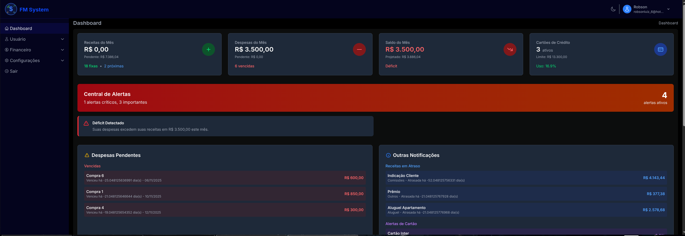
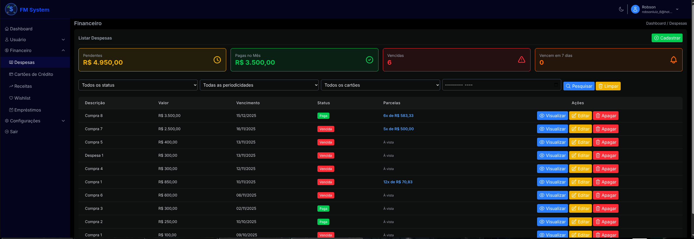
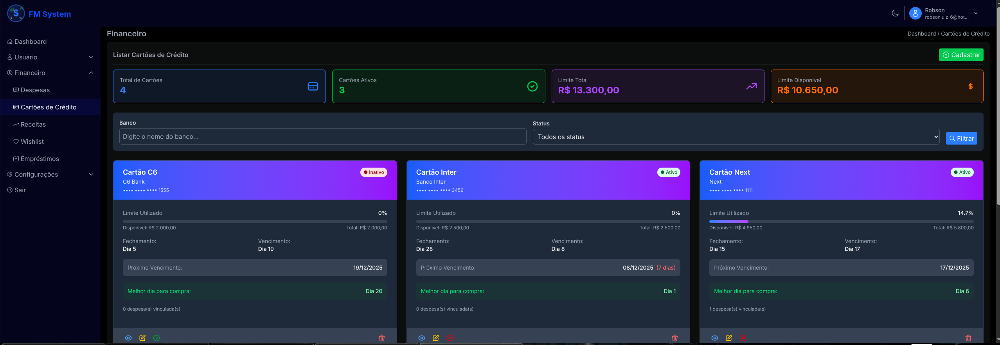
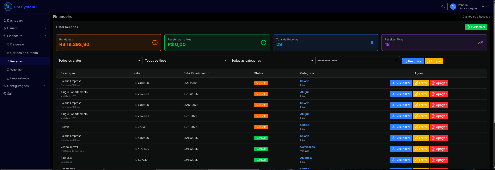

**FM System v2** - Sistema de Gerenciamento Financeiro Pessoal com Laravel 12.

> 💡 **Sobre as Versões**: Esta é a versão 2 do FM System, completamente reescrita com Laravel 12. A versão 1 foi desenvolvida em PHP puro e não está disponível publicamente.

---

## 🌐 **Idiomas / Languages**

- 🇧🇷 **Português**: [README.md](./README.md)
- 🇺🇸 **English**: [README.en.md](./README.en.md)

---

## Screenshots

### Dashboard

*Dashboard financeiro completo com estatísticas, gráficos e alertas inteligentes*

### Gerenciamento de Despesas

*Gerenciamento avançado de despesas com sistema de parcelas flexíveis*

### Controle de Cartões de Crédito

*Controle inteligente de cartões de crédito com monitoramento de limite em tempo real*

### Sistema de Receitas

*Gerenciamento completo de receitas com categorização e filtros inteligentes*

## Requisitos

* PHP 8.2 ou superior - Conferir a versão: php -v
* MySQL 8.0 ou superior - Conferir a versão: mysql --version
* Composer - Conferir a instalação: composer --version
* Node.js 22 ou superior - Conferir a versão: node -v
* NPM ou Yarn - Para gerenciar dependências do Node.js e compilar assets
* GIT - Conferir se está instalado o GIT: git -v

**Frontend:**
* Tailwind CSS v4 - Incluído como dependência do projeto (instalado via npm)

## Como rodar o projeto baixado

Primeiro, baixe o projeto do repositório GitHub:
```
git clone https://github.com/robson-luiz/fm-system-v2-laravel.git
cd fm-system-v2-laravel
```

- Duplicar o arquivo ".env.example" e renomear para ".env".
- Alterar as credenciais do banco de dados.
```
DB_CONNECTION=mysql
DB_HOST=127.0.0.1
DB_PORT=3306
DB_DATABASE=fm_system_v2
DB_USERNAME=root
DB_PASSWORD=
```

- Para a funcionalidade enviar e-mail funcionar, necessário alterar as credenciais do servidor de envio de e-mail no arquivo .env.
- Utilizar o servidor fake durante o desenvolvimento: [Acessar envio gratuito de e-mail](https://mailtrap.io)
```
MAIL_MAILER=smtp
MAIL_SCHEME=null
MAIL_HOST=sandbox.smtp.mailtrap.io
MAIL_PORT=2525
MAIL_USERNAME=nome-do-usuario-na-mailtrap
MAIL_PASSWORD=senha-do-usuario-na-mailtrap
MAIL_FROM_ADDRESS="colocar-email-remetente@meu-dominio.com.br"
MAIL_FROM_NAME="${APP_NAME}"
```

Instalar as dependências do PHP.
```
composer install
```

Instalar as dependências do Node.js.
```
npm install
```

Gerar a chave no arquivo .env.
```
php artisan key:generate
```

Executar as migrations para criar as tabelas e as colunas.
```
php artisan migrate
```

Executar seed com php artisan para cadastrar registros de testes.
```
php artisan db:seed
```

Iniciar o projeto criado com Laravel.
```
php artisan serve
```

Iniciar o projeto criado com Laravel na porta específica.
```
php artisan serve --port=8082
```

Executar as bibliotecas Node.js.
```
npm run dev
```

Executar os Jobs no PC local.
```
php artisan queue:work
```

Acessar a página criada com Laravel.
```
http://127.0.0.1:8000
```

## Bibliotecas e Dependências Incluídas

O projeto já vem com as seguintes bibliotecas pré-instaladas:

**Frontend:**
- **Tailwind CSS v4** - Framework CSS utilitário
- **Alpine.js v3** - Framework JavaScript reativo
- **Chart.js v4** - Biblioteca para gráficos
- **SweetAlert2** - Alertas personalizados elegantes

**Backend:**
- **Spatie Laravel Permission** - Sistema de permissões e roles
- **OwenIt Laravel Auditing** - Auditoria de ações do sistema
- **Intervention Image** - Manipulação de imagens
- **Laravel Tinker** - REPL interativo do Laravel

**Desenvolvimento:**
- **Laravel Pint** - Formatador de código PHP
- **Laravel Sail** - Ambiente Docker (opcional)
- **Faker** - Geração de dados fake para testes

Para instalar todas as dependências após clonar o projeto:
```
composer install
npm install
```

## Sobre o Projeto

### FM System v2

**FM System v2** é um sistema de gerenciamento financeiro pessoal desenvolvido com Laravel 12, focado em ajudar usuários a controlarem suas finanças de forma inteligente e proativa.

**Por que versão 2?**

Este projeto é a **segunda versão** do FM System. A versão 1 foi desenvolvida inteiramente em PHP puro como parte do aprendizado inicial de desenvolvimento web. Com o avanço dos estudos e a adoção de frameworks modernos, o sistema foi completamente reescrito utilizando Laravel 12, trazendo:

- 🏗️ Arquitetura MVC robusta
- 🔒 Sistema de autenticação e permissões integrado
- 🎨 Interface moderna com Tailwind CSS v4
- ⚡ Performance otimizada
- 📝 Código organizado e escalável
- 🧪 Facilidade para testes

A versão 1 (PHP puro) permanece como projeto pessoal de aprendizado e não está disponível publicamente.

### Funcionalidades Principais

- 🔐 **Sistema de autenticação robusto** com login de dois fatores (2FA)
- 💰 **Gerenciamento inteligente de despesas** com sistema de parcelas flexíveis
- 💳 **Controle de cartões de crédito** com análise de melhor data de compra
- 📊 **Dashboard financeiro** com gráficos e relatórios detalhados
- 🎯 **Wishlist inteligente** com análise de viabilidade financeira
- 🔔 **Alertas proativos** de pagamentos e vencimentos
- 👥 **Sistema completo de permissões** e auditoria de ações
- 🎨 **Interface moderna** com tema claro/escuro e design responsivo

### Roadmap

**Base Inicial do Sistema** ✅ Concluída
- [x] Sistema de autenticação e permissões (Spatie)
- [x] Gerenciamento de usuários com roles
- [x] Sistema de auditoria (OwenIt/laravel-auditing)
- [x] Interface responsiva com Tailwind CSS v4
- [x] Suporte a tema claro/escuro

**Fase 1 - Gestão de Despesas** ✅ Concluída (07/10/2025)
- [x] CRUD completo de despesas
- [x] Sistema de parcelas com tabela separada
- [x] Parcelas fixas (valores iguais)
- [x] Parcelas flexíveis (valores personalizados)
- [x] Validação em tempo real de valores
- [x] Marcação individual de parcelas pagas
- [x] Histórico de pagamentos

**Fase 2 - Login com 2 Fatores** ✅ Concluída (25/10/2025)
- [x] Implementação de autenticação de dois fatores (2FA)
- [x] Configuração administrativa para escolha do método de envio
- [x] Envio de código via e-mail
- [x] Envio de código via SMS
- [x] Interface de configuração no painel administrativo
- [x] Validação e verificação de códigos temporários
- [x] Backup codes para recuperação de acesso
- [x] Logs de segurança para tentativas de login
- [x] **Provedores SMS Customizados**: Configure qualquer provedor SMS (Iagente, ZenviaNow, TotalVoice, etc)
- [x] **Verificação completa do sistema 2FA** - (09/11/2025)

**Fase 3 - Cartões de Crédito** ✅ Concluída (09/11/2025)
- [x] CRUD de cartões de crédito
- [x] Vinculação de despesas com cartões
- [x] Controle de limite e fatura
- [x] Alerta de melhor dia de compra
- [x] Cálculo automático de limite disponível
- [x] Observer para atualização em tempo real
- [x] Ajustes de UI/UX e responsividade móvel

**Fase 4 - Sistema de Receitas** ✅ Concluída (16/11/2025)
- [x] CRUD completo de receitas
- [x] Sistema de categorização (Salário, Freelance, Vendas, Investimentos, Aluguel, Comissões, Outros)
- [x] Tipos de receita (Fixa e Variável)
- [x] Status de recebimento (Pendente e Recebida)
- [x] Interface tabular padronizada seguindo padrão de despesas
- [x] Estatísticas em tempo real (pendentes, recebidas no mês, total, receitas fixas)
- [x] Filtros avançados por status, tipo, categoria e período mensal
- [x] Sistema de fontes/origem das receitas
- [x] Observações personalizadas
- [x] Seeder com dados realísticos para testes
- [x] Validações completas (frontend e backend)
- [x] **Refinamentos (16/11/2025)**: Correções no formulário de edição, máscaras centralizadas, SweetAlert2 e ajustes de tema

**Fase 5 - Dashboard e Relatórios** ✅ Concluída (30/11/2025)
- [x] Dashboard financeiro principal com estatísticas gerais
- [x] Gráficos interativos (Chart.js) de receitas vs despesas
- [x] Verificação automática de pagamentos pendentes
- [x] Sistema de alertas inteligentes
- [x] Central de alertas com prioridades (high, medium, low)
- [x] Análise de saúde financeira (déficit/superávit)
- [x] Gráficos de uso dos cartões de crédito
- [x] Interface responsiva com tema claro/escuro

**Fase 5.1 - Análises Avançadas** 📋 Futuro
- [ ] **Modal Inteligente de Verificação**: Sistema que verifica contas pendentes no login e pergunta "Essas contas já foram pagas?" com atualização automática do status
- [ ] **Atualização Dinâmica do Dashboard**: Recálculo automático das estatísticas após mudanças de status das contas
- [ ] Análise de fluxo de caixa mensal/anual com projeções
- [ ] Wishlist inteligente com análise de viabilidade financeira
- [ ] Sistema de categorias para despesas (Alimentação, Transporte, Lazer, etc.)
- [ ] Relatórios de tendências e projeções baseados em histórico
- [ ] Comparativo de gastos por categoria com metas
- [ ] Alertas de mudanças significativas nos padrões de consumo
- [ ] Sistema de metas financeiras por categoria
- [ ] Export de relatórios em PDF/Excel

**Fase 6 - Recursos Avançados** 📋 Futuro
- [ ] **Sistema Multiusuário**: Isolamento completo de dados por usuário
- [ ] **E-mail Diário Automatizado**: Notificações automáticas de contas a vencer (CRON)
- [ ] **Configurações Personalizáveis**: Ativar/desativar notificações e modais por usuário
- [ ] **Notificações por e-mail/SMS avançadas e personalizáveis**: Expansão do sistema SMS customizável existente
- [ ] Integração com IA para análises preditivas
- [ ] Open Banking para sincronização automática
- [ ] Sistema multi-moeda com conversão automática
- [ ] Integração com APIs de investimentos
- [ ] Sistema de backup automático na nuvem

---

## Funcionalidades Implementadas

### 📊 Sistema de Despesas (Fase 1 - Concluída em 07/10/2025)

#### **CRUD Completo**
- ✅ Listagem com filtros (status, periodicidade, cartão, mês)
- ✅ Cadastro com validações
- ✅ Visualização detalhada
- ✅ Edição de despesas
- ✅ Exclusão com confirmação (SweetAlert2)

#### **Sistema de Parcelas Inteligente**

**1. Arquitetura Refatorada**
- Tabela separada `installments` para gerenciar parcelas
- Cada despesa pode ter múltiplas parcelas independentes
- Relacionamento `hasMany` entre Expense e Installment

**2. Tipos de Parcelamento**

**Parcelas Fixas (Automático)**
```
Valor: R$ 3.000,00 | Parcelas: 3
Resultado: 3x de R$ 1.000,00
```
- Sistema divide automaticamente
- Última parcela ajusta arredondamento
- Datas calculadas mensalmente

**Parcelas Flexíveis (Personalizado)**
```
Exemplo: Entrada + Parcelas diferentes
- Entrada: R$ 500,00 (Nov/2025)
- Parcela 2: R$ 300,00 (Dez/2025)
- Parcela 3: R$ 400,00 (Jan/2026)
- Parcela 4: R$ 300,00 (Fev/2026)
```
- Valores personalizados para cada parcela
- Datas de vencimento individuais
- Validação em tempo real da soma
- Feedback visual: ✓ (confere) | ⚠ (diferença)

**3. Gerenciamento Individual de Parcelas**
- Visualização em tabela na página de detalhes
- Estatísticas: Total, Pagas, Pendentes, Vencidas
- Marcar parcela individual como paga (via AJAX)
- Desfazer pagamento de parcela
- Modais interativos com SweetAlert2

**4. Interface e UX**
- Toggle intuitivo: "Parcelas Iguais" ↔ "Parcelas Personalizadas"
- Gerador dinâmico de campos
- Máscara de dinheiro (R$ 1.000,00)
- Conversão automática no submit
- Suporte a tema claro/escuro
- Responsivo (mobile-first)

**5. Recursos Técnicos**
- **Transações DB**: Atomicidade garantida
- **Eager Loading**: Performance otimizada
- **AJAX**: Ações sem reload de página
- **Validações**: Frontend (JavaScript) + Backend (Laravel)
- **Auditoria**: Todas as ações registradas
- **Permissões**: Controle granular por ação

#### **Alertas e Feedback**
- Despesas vencidas (badge vermelho)
- Vencimento próximo (7 dias - badge laranja)
- Status visual por cores
- Mensagens de sucesso/erro com SweetAlert2

#### **Filtros e Pesquisa**
- Filtro por status (pendente, paga)
- Filtro por periodicidade
- Filtro por cartão de crédito
- Filtro por mês/ano
- Estatísticas em cards

### 🔐 Sistema de Autenticação 2FA (Fase 2 - Concluída em 25/10/2025)

#### **Autenticação de Dois Fatores**
- ✅ **Verificação por E-mail**: Códigos de 6 dígitos via SMTP
- ✅ **Verificação por SMS**: Integração com provedores SMS
- ✅ **Backup Codes**: Códigos de recuperação para emergências
- ✅ **Configuração Flexível**: Admin escolhe método padrão por usuário

#### **Painel Administrativo Completo**
- ✅ **Configurações de E-mail**: SMTP configurável via interface
- ✅ **Configurações de SMS**: Múltiplos provedores suportados
- ✅ **Teste Integrado**: Teste de envio direto no painel
- ✅ **Estatísticas**: Monitoramento de códigos enviados/validados

#### **Provedores SMS Customizados** 🇧🇷
**Sistema revolucionário que permite configurar QUALQUER provedor SMS**

**Características:**
- ✅ **Flexibilidade Total**: Configure qualquer API REST
- ✅ **Provedores Brasileiros**: Iagente, ZenviaNow, TotalVoice
- ✅ **Provedores Internacionais**: Twilio, Nexmo, etc
- ✅ **Interface Amigável**: Configure sem tocar no código
- ✅ **Teste em Tempo Real**: Validação antes de ativar

**Configuração Simples:**
```
Nome: Iagente
URL: https://api.iagente.com.br/v1/sms/send
Método: POST
Campo Telefone: to
Campo Mensagem: message
Headers: Authorization: Bearer TOKEN
Indicadores: status: success
```

**Benefícios:**
- 🚫 **Sem Vendor Lock-in**: Mude de provedor quando quiser
- 🇧🇷 **Suporte Nacional**: Use empresas brasileiras
- 💰 **Economia**: Escolha o provedor mais barato
- 🔧 **Manutenção Zero**: Configure uma vez, funciona sempre
- 📊 **Logs Detalhados**: Monitore todos os envios

#### **Recursos Técnicos 2FA**
- **Guzzle HTTP**: Cliente HTTP robusto para APIs SMS
- **Validação Dinâmica**: Headers e campos personalizáveis
- **Rate Limiting**: Proteção contra spam de códigos
- **Auditoria Completa**: Log de todas as tentativas
- **Segurança Avançada**: Códigos com tempo de expiração

### 💳 Sistema de Cartões de Crédito (Fase 3 - Concluída em 02/11/2025)

#### **CRUD Completo de Cartões**
- ✅ **Listagem Inteligente**: Cards visuais com estatísticas em tempo real
- ✅ **Cadastro Avançado**: Validações, máscaras de dinheiro e cálculos automáticos
- ✅ **Visualização Detalhada**: Interface tipo "cartão físico" com informações completas
- ✅ **Edição Flexível**: Atualização com controle de limite automático/manual

#### **Controle de Limite Inteligente**
- ✅ **Cálculo Automático**: Observer atualiza limite em tempo real baseado nas despesas
- ✅ **Modo Manual**: Controle direto do usuário sobre limite disponível
- ✅ **Validações**: Previne limite disponível maior que limite total
- ✅ **Feedback Visual**: Gráficos circulares e barras de progresso do uso

#### **Integração com Despesas**
- ✅ **Vinculação Automática**: Despesas ligadas a cartões específicos
- ✅ **Atualização em Tempo Real**: Observer monitora criação/edição/exclusão de despesas
- ✅ **Histórico de Transações**: Visualização das despesas recentes por cartão
- ✅ **Estatísticas Detalhadas**: Total de despesas, valores pendentes e pagos

#### **Análise de Melhor Dia para Compra**
- ✅ **Cálculo Automático**: Sistema identifica melhor data baseado no fechamento
- ✅ **Configuração Manual**: Usuário pode definir dia preferido
- ✅ **Alertas Visuais**: Destaque do próximo vencimento e dias restantes
- ✅ **Planejamento Financeiro**: Informações para maximizar prazo de pagamento

#### **Interface e UX**
- ✅ **Design Responsivo**: Adaptado para mobile e desktop
- ✅ **Tema Claro/Escuro**: Suporte completo aos dois temas
- ✅ **Máscaras de Dinheiro**: Formatação automática de valores monetários
- ✅ **Alertas Inteligentes**: SweetAlert2 para confirmações e feedback
- ✅ **Navegação Intuitiva**: Breadcrumbs e botões de ação contextuais

#### **Recursos Técnicos**
- **Observer Pattern**: ExpenseObserver para atualização automática de limites
- **Eloquent Relationships**: Relacionamentos otimizados entre cartões e despesas
- **JavaScript Modular**: Máscaras de dinheiro e validações em tempo real
- **Migrations Versionadas**: Campo `auto_calculate_limit` para configuração
- ✅ **Comando Artisan**: `credit-cards:update-limits` para manutenção
- ✅ **Ajustes de Legibilidade (16/11/2025)**: Melhorias em cores de texto para tema escuro

> ⚠️ **Status**: Funcionalidade completa e operacional. Ajustes de legibilidade implementados em 16/11/2025.

### 💰 Sistema de Receitas (Fase 4 - Concluída em 16/11/2025)

#### **CRUD Completo de Receitas**
- ✅ **Listagem Inteligente**: Interface tabular padronizada seguindo o padrão de despesas
- ✅ **Cadastro Avançado**: Formulário com validações completas e máscara de dinheiro centralizada
- ✅ **Visualização Detalhada**: Cards informativos com todas as informações da receita
- ✅ **Edição Refinada**: Formulário corrigido com dados pré-preenchidos e categorias funcionais

#### **Sistema de Categorização**
- ✅ **Categorias Padrão**: Salário, Freelance, Vendas, Investimentos, Aluguel, Comissões, Outros
- ✅ **Tipos de Receita**: 
  - **Fixa**: Receitas regulares e previsíveis (salário, aluguel)
  - **Variável**: Receitas ocasionais e variáveis (freelance, vendas)
- ✅ **Fonte/Origem**: Campo opcional para identificar a fonte da receita
- ✅ **Status de Recebimento**: Pendente (laranja) e Recebida (verde)

#### **Estatísticas em Tempo Real**
- ✅ **Pendentes**: Valor total em receitas pendentes (R$)
- ✅ **Recebidas no Mês**: Total recebido no mês atual (R$)
- ✅ **Total de Receitas**: Contador total de receitas cadastradas
- ✅ **Receitas Fixas**: Contador de receitas do tipo fixa

#### **Sistema de Filtros e Pesquisa**
- ✅ **Filtro por Status**: Todos, Pendentes, Recebidas
- ✅ **Filtro por Tipo**: Todos, Receita Fixa, Receita Variável
- ✅ **Filtro por Categoria**: Todas as categorias disponíveis
- ✅ **Filtro por Período**: Seleção de mês/ano específico
- ✅ **Botões de Ação**: Pesquisar (azul) e Limpar filtros (amarelo)

#### **Interface e Experiência do Usuário**
- ✅ **Design Consistente**: Segue exatamente o padrão visual de despesas
- ✅ **Tabela Responsiva**: Colunas ocultas em mobile, informações adaptadas
- ✅ **Ações Contextuais**: Visualizar, Editar e Excluir com ícones intuitivos
- ✅ **Validações em Tempo Real**: Máscaras de dinheiro centralizadas via `money-mask.js`
- ✅ **Feedback Visual**: SweetAlert2 integrado para exclusão elegante
- ✅ **Tema Claro/Escuro**: Ajustes de legibilidade em cores de texto

#### **Recursos Técnicos**
- **Eloquent Scopes**: `forUser()`, `byStatus()`, `byCategory()`, `byType()`, `currentMonth()`
- **Request Validation**: `IncomeRequest` com validações completas
- **Seeder Inteligente**: `IncomeSeeder` com dados realísticos dos últimos 6 meses
- **Formatação Automática**: Accessors para valores monetários formatados
- **Relacionamentos**: Receitas vinculadas a usuários com controle de acesso
- **JavaScript Modular**: Scripts centralizados para máscaras de dinheiro

#### **Refinamentos Técnicos (16/11/2025)**
- ✅ **Formulário de Edição**: Corrigido problema com `getDefaultCategories()` substituído por `$categories`
- ✅ **Máscaras de Dinheiro**: Centralizadas no `money-mask.js`, removidos scripts duplicados
- ✅ **SweetAlert2**: Implementado para exclusão de receitas com modais elegantes
- ✅ **Legibilidade**: Ajustadas cores de texto para tema escuro em cartões
- ✅ **Testes**: Corrigidos 2 testes com falhas, todos os 9 testes agora passam

#### **Dados de Teste Realísticos**
- ✅ **Período Abrangente**: Receitas dos últimos 6 meses + próximos 3 meses
- ✅ **Variedade de Valores**: Baseados na categoria (salário: R$ 2.800-12.000)
- ✅ **Receitas Recorrentes**: Salário e aluguel fixos mensais
- ✅ **Observações Contextuais**: Notas específicas por categoria
- ✅ **Status Inteligente**: 85% das receitas passadas marcadas como recebidas

### 📊 Dashboard e Relatórios (Fase 5 - Concluída em 30/11/2025)

#### **Dashboard Financeiro Completo**
- ✅ **Cards Estatísticos**: Receitas do mês, despesas, cartões de crédito e saldo geral
- ✅ **DashboardController**: Sistema otimizado com consultas agregadas para performance
- ✅ **AlertService**: Serviço dedicado para análise e geração de alertas inteligentes
- ✅ **Estatísticas em Tempo Real**: Todos os dados atualizados dinamicamente

#### **Sistema de Alertas Inteligentes**
- ✅ **Central de Alertas**: Interface dedicada com cores tema-aware (vermelho suave)
- ✅ **Prioridades**: Sistema de alta, média e baixa prioridade com contadores
- ✅ **Alertas Financeiros**: Detecção automática de déficit, oportunidades de investimento
- ✅ **Alertas de Vencimento**: Despesas vencidas, vencendo em breve, receitas atrasadas
- ✅ **Alertas de Cartão**: Limite próximo ao máximo, melhores datas para compra
- ✅ **Sugestões Inteligentes**: Ações recomendadas para cada tipo de alerta

#### **Gráficos Interativos com Chart.js v4**
- ✅ **Receitas vs Despesas**: Gráfico de linha comparativo dos últimos 6 meses
- ✅ **Uso dos Cartões**: Gráfico de rosca mostrando percentual de uso por cartão
- ✅ **Tema Compatível**: Cores que se adaptam ao tema claro/escuro automaticamente
- ✅ **Responsividade**: Gráficos otimizados para mobile e desktop

#### **Interface e Experiência do Usuário**
- ✅ **Design Responsivo**: Mobile-first com adaptação perfeita para todos os dispositivos
- ✅ **Tema Claro/Escuro**: Suporte completo com cores balanceadas
- ✅ **Performance**: Consultas otimizadas com eager loading e agregações
- ✅ **Navegação Intuitiva**: Layout organizado com informações hierarquizadas

#### **Recursos Técnicos Implementados**
- **DashboardController.php**: Métodos otimizados para estatísticas (receitas, despesas, cartões)
- **AlertService.php**: 200+ linhas de lógica inteligente para detecção de padrões
- **Consultas Otimizadas**: Uso de `selectRaw()` e agregações para performance
- **Alpine.js**: Componentes reativos para interatividade
- **Chart.js CDN**: Carregamento otimizado da biblioteca de gráficos
- **@stack('scripts')**: Sistema de scripts modulares no layout

> ✅ **Status**: Dashboard completo e totalmente funcional. Pronto para Fase 5.1 - Análises Avançadas.

---

## 🚀 Próximas Funcionalidades

### Fase 5.1 - Análises Avançadas (Futuro)

#### **Modal Inteligente de Verificação de Contas** 🧠
**Funcionalidade revolucionária que analisa contas pendentes automaticamente no login:**

**Como funcionará:**
1. **Análise Automática**: Quando o usuário faz login, o sistema analisa:
   - Despesas com status "pendente"
   - Data de vencimento já passou
   - Tempo desde o vencimento

2. **Modal Inteligente**: Sistema exibe modal perguntando:
   ```
   "Detectamos contas vencidas. Essas contas já foram pagas?"
   
   [Lista das contas vencidas com valores e datas]
   
   [Marcar como Pagas] [Deixar Pendentes]
   ```

3. **Atualização Inteligente**: 
   - **Se "Marcar como Pagas"**: Atualiza status para "paid" + data de pagamento
   - **Se "Deixar Pendentes"**: Mantém status + exibe alerta "Pague o mais rápido possível"

4. **Recálculo Automático**: Dashboard atualiza estatísticas instantaneamente após mudanças

**Benefícios:**
- 🎯 **Proatividade**: Sistema antecipa necessidades do usuário
- ⚡ **Agilidade**: Atualização rápida de múltiplas contas
- 📊 **Precisão**: Dashboard sempre atualizado com dados reais
- 🧠 **Inteligência**: Aprende padrões de pagamento do usuário

---

## Estrutura de Banco de Dados

### Tabela: `expenses`
```sql
- id, user_id, credit_card_id
- description, amount
- due_date, periodicity, status
- payment_date, num_installments
- reason_not_paid
- timestamps
```

### Tabela: `installments`
```sql
- id, expense_id
- installment_number
- amount, due_date, status
- payment_date, reason_not_paid
- timestamps
```

### Tabela: `incomes`
```sql
- id, user_id
- description, amount
- received_date, category, type
- status, source, notes
- timestamps
```

### Tabela: `credit_cards`
```sql
- id, user_id
- name, bank, last_four_digits
- card_limit, available_limit
- closing_day, due_day, best_purchase_day
- interest_rate, annual_fee
- is_active, auto_calculate_limit
- timestamps
```

**Relacionamentos:**
- 1 Expense → N Installments (cascade delete)
- 1 CreditCard → N Expenses (nullable foreign key)
- 1 User → N CreditCards (user ownership)
- 1 User → N Incomes (user ownership)

---

## Contribuindo

Contribuições são bem-vindas! Sinta-se à vontade para abrir issues ou enviar pull requests.

## Licença

Este projeto está licenciado sob a licença MIT.